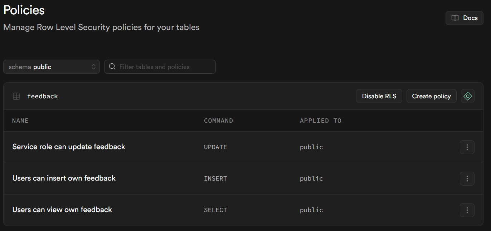

# Smart Feedback Portal

A Customer Feedback Portal built with Next.js, Supabase, and n8n. Users can submit feedback that gets automatically classified and prioritized using an automated backend workflow.

**🚀 Live Deployment:** [https://feedback-outbound.vercel.app/](https://feedback-outbound.vercel.app/)

## Application Overview

This project demonstrates a complete integration between a modern frontend, a Backend-as-a-Service (BaaS) provider, and an automation platform.

**Core Technologies:**
*   **Frontend:** Next.js 14+ (App Router), TypeScript, Tailwind CSS
*   **Database & Auth:** Supabase (PostgreSQL, RLS, Auth Helpers)
*   **Automation:** n8n (Webhook triggers, Conditional logic, HTTP Requests)

## Demo

> **Note:** This video showcases an earlier version of the interface. It is included to demonstrate the application's **Real-time capabilities** and **Row Level Security (RLS)**, which remain the core foundational logic.

[](https://youtu.be/nub5e3UuJOs)

## Features

*   **Secure Authentication:** Full Email/Password login flows protected by Next.js Middleware and Supabase Auth.
*   **Real-time Dashboard:** Live updates for feedback status using Supabase Realtime (WebSocket)—watch your feedback get processed instantly.
*   **Automated Classification:** Backend n8n workflows analyze description text to automatically assign **Priority** (High/Low) and **Category** (Bug/General) using LLMs.
*   **Dark Mode Support:** Fully integrated system-aware theme switching with a manual toggle.
*   **Advanced Filtering & Search:** Client-side filtering by multiple criteria (Status, Priority, Category) and instant text search.
*   **Optimistic UI:** Instant feedback on submission (showing "Pending" state) without waiting for server confirmation.
*   **Modern Responsive Layout:** Smart split-view dashboard (Sticky sidebar on desktop) and optimized mobile experience.
*   **Pagination:** Client-side pagination to efficiently handle and navigate large lists of feedback.
*   **Manual Retry Mechanism:** Ability to manually re-trigger classification for individual items if the automation service is temporarily unavailable.

## Project Structure

```
├── src/
│   ├── app/             # Next.js App Router pages (Dashboard, Login, API)
│   ├── components/      # React components
│   │   ├── feedback/    # Feature-specific components (Forms, Lists)
│   │   └── ui/          # Reusable shadcn/ui components
│   ├── context/         # React Context (Global State)
│   ├── hooks/           # Custom React Hooks
│   ├── lib/             # Utility functions and Supabase client
│   └── types/           # TypeScript definitions
├── supabase/            # Database initialization SQL
└── workflows/           # n8n automation workflow JSON
```

## Prerequisites

Ensure you have the following services and tools ready:

1.  **Node.js Runtime:** Node.js v18+ or Bun.
2.  **Supabase Account:** A free tier project.
3.  **n8n Account:** n8n Cloud (trial) or a self-hosted instance reachable by Supabase.

## Setup Instructions

### 1. Repository Setup

Clone the repository and install dependencies:

```bash
git clone <your-repo-url>
cd feedback-portal
bun install
# or npm install
```

### 2. Supabase Configuration

1.  Create a new project at Supabase.
2.  Navigate to **Settings > API** and note down:
    *   Project URL
    *   Project API Key (anon/public)
    *   Service Role Key (secret) - *Required for n8n*
3.  Navigate to the **SQL Editor** in the side menu.
4.  Copy the contents of `supabase/schema.sql` from this repository and run the query. This will:
    *   Create the `feedback` table.
    *   Enable Row Level Security (RLS).
    *   Create necessary RLS policies.
    *   Enable Realtime replication for the table.
5.  Navigate to **Authentication > Providers** and ensure **Email** is enabled.

### 3. Environment Variables

Create a file named `.env.local` in the project root:

```env
NEXT_PUBLIC_SUPABASE_URL=https://your-project-ref.supabase.co
NEXT_PUBLIC_SUPABASE_ANON_KEY=your-anon-key-here
```

### 4. n8n Workflow Setup

The automation logic is defined in `workflows/feedback-classification.json`.

1.  **Import Workflow:**
    *   Open your n8n dashboard.
    *   Select **Workflows** > **Import from File**.
    *   Upload `workflows/feedback-classification.json`.

2.  **Configure Credentials (Groq AI):**
    *   Sign up at [Groq Cloud](https://console.groq.com) and create an API Key.
    *   In n8n, open the **AI Classifier** node.
    *   Under **Authentication**, create a new credential (Header Auth) or update the existing one.
    *   **Header Name:** `Authorization`
    *   **Value:** `Bearer YOUR_GROQ_API_KEY`

3.  **Configure Supabase Connection:**
    Open the **Supabase Update** node in n8n and update the following fields manually:
    *   **URL:** Replace `{{ $env.SUPABASE_URL }}` with your Supabase Project URL.
    *   **Headers:**
        *   Replace `{{ $env.SUPABASE_SERVICE_KEY }}` in `apikey` with your **Service Role Key**.
        *   Replace `{{ $env.SUPABASE_SERVICE_KEY }}` in `Authorization` with your **Service Role Key**.

4.  **Activate Webhook:**
    *   Toggle the workflow status to **Active** (Green).
    *   Double-click the **Webhook** node and copy the **Production URL**.

4.  **Connect Supabase Trigger:**
    *   Go to Supabase Dashboard > **Database > Webhooks**.
    *   Create a new webhook:
        *   **Name:** `feedback-classifier`
        *   **Table:** `public.feedback`
        *   **Events:** Select `INSERT`.
        *   **Method:** `POST`
        *   **URL:** Paste the n8n Production URL copied in the previous step.

### 5. Running the Application

Start the development server:

```bash
bun dev
# or npm run dev
```

Navigate to `http://localhost:3000` to access the portal.

## Row Level Security (RLS) Policies

To ensure data security, the following strict policies are applied to the `feedback` table:

| Policy Name | Action | Logic |
| :--- | :--- | :--- |
| **Users can view own feedback** | SELECT | `auth.uid() = user_id` |
| **Users can insert own feedback** | INSERT | `auth.uid() = user_id` |
| **Service role can update feedback** | UPDATE | `auth.role() = 'service_role'` |



### RLS Policy SQL Implementation

```sql
-- Users can only view their own feedback
CREATE POLICY "Users can view own feedback" ON feedback
  FOR SELECT
  USING (auth.uid() = user_id);

-- Users can only insert their own feedback
CREATE POLICY "Users can insert own feedback" ON feedback
  FOR INSERT
  WITH CHECK (auth.uid() = user_id);

-- Service role can update any feedback (for n8n webhook)
CREATE POLICY "Service role can update feedback" ON feedback
  FOR UPDATE
  USING (auth.role() = 'service_role')
  WITH CHECK (auth.role() = 'service_role');
```

This configuration ensures that users cannot access or modify others' feedback, while allowing the automationi service (n8n) to categorize entries via the Service Role.

## Automation Logic (AI-Powered)

The n8n workflow is designed to be resilient and fail-safe, processing incoming data using an LLM (Large Language Model) for intelligent classification.


The workflow follows a robust multi-path logic to handle various scenarios:

### 1. Happy Path (AI Classification)
*   **Trigger:** Listens for `INSERT` events on the `feedback` table via Supabase Webhook.
*   **Analysis:** Sends the feedback description to **Groq (Llama-3.3-70b)**. The system prompt instructs the AI to detect specific keywords (`error`, `broken`, `crash`, `urgent`, `fail`) to determine urgency.
*   **Resilience:** The AI request node is configured to **retry 3 times** on failure (e.g., rate limits or timeouts) before falling back.
*   **Output:** The LLM returns a structured JSON object: `{ "category": "Bug"|"General", "priority": "High"|"Low" }`.
*   **Update:** Updates the record in Supabase with the AI-determined tags and sets status to `Processed`.

### 2. Fallback Mechanism (AI Service Failure)
If the AI service is down, rate-limited, or times out:
*   The workflow automatically catches the error.
*   **Action:** Applies default classification values (`Category: General`, `Priority: Low`).
*   **Result:** The user's feedback is still marked as `Processed` so it doesn't get stuck in a pending state.

### 3. Error Reporting (Database Failure)
If the primary update to Supabase fails (e.g., due to schema mismatch or constraint violations):
*   **Action:** A secondary update node attempts to set the feedback status to `Error`.
*   **Result:** Admins can easily filter and investigate failed submissions from the dashboard.
